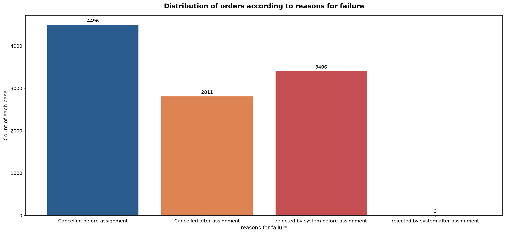
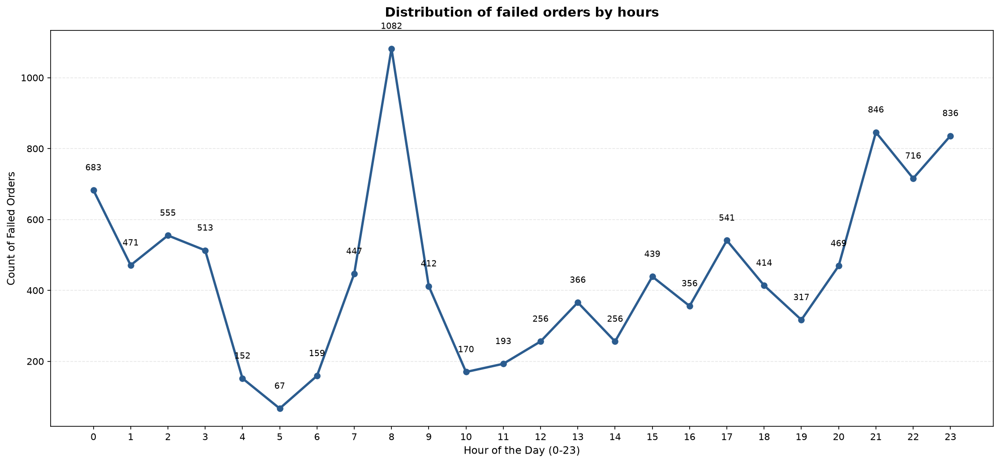
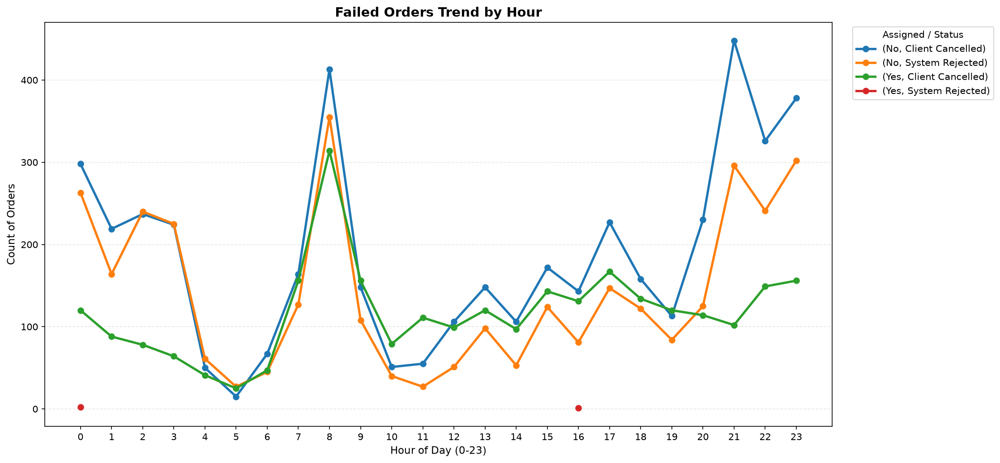
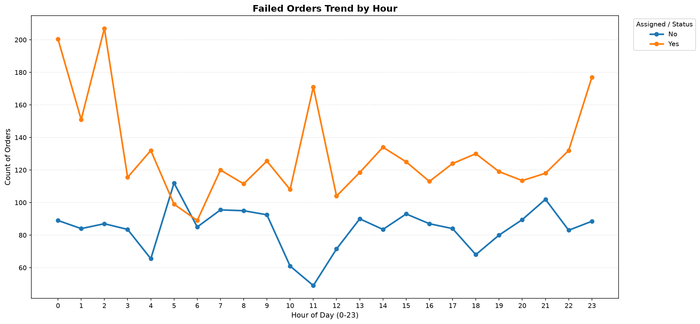
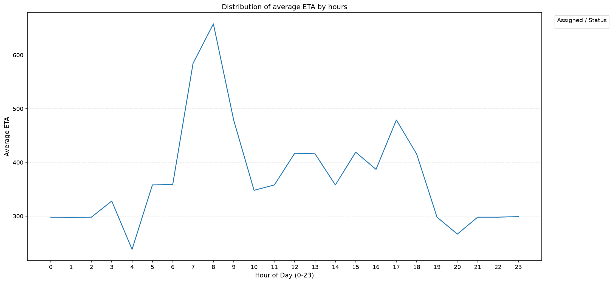
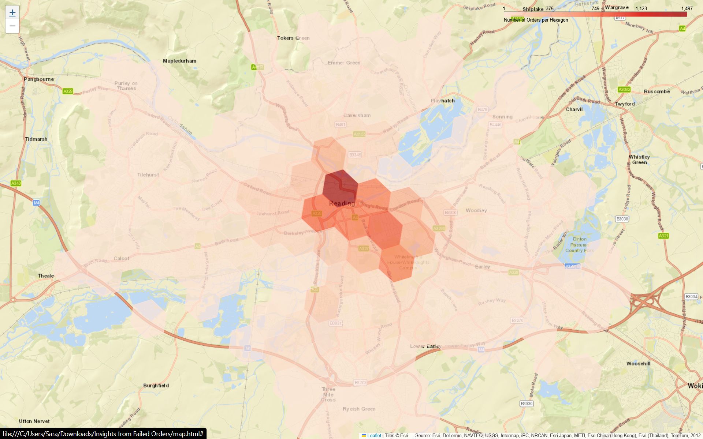

## Insights from Failed Orders
Diagnosing delivery/ride order failures (Reading, UK) via cancellation
patterns and H3 geospatial hex clustering.

**Tools:** Python, Pandas, Matplotlib, H3, Folium

### Data
`data_orders.csv` and `data_offers.csv` are included in this repo.
Note: `data_offers.csv` maps orders to driver offers and was not
needed for this analysis, since every question concerns unique orders.

---

### 1. Distribution of Orders by Reason for Failure

The largest failure category is **client cancellations before a driver
is assigned** (4,496 orders, ~42% of all failures), followed by
**system rejections** — which happen almost exclusively before
assignment (3,406 vs. only 3 after). Client cancellations after
assignment total 2,811.

This suggests two distinct problems: slow driver-matching drives early
client cancellations, while system rejections point to a separate
availability/eligibility issue that occurs before matching even
completes.

---

### 2. Distribution of Failed Orders by Hour

Failures peak sharply at **8 AM (1,082 orders, ~10% of all failures)**,
well above the next-highest hours (21:00 with 846 and 23:00 with 836).
The 8 AM spike likely reflects the morning commute demand surge
outpacing available drivers. The secondary rise between 21:00–23:00
suggests a similar supply gap during the evening/night-out period.
Failures drop to their lowest between 4–6 AM (as low as 67 at 5 AM),
consistent with low overall demand overnight.

---

### 3. Average Time to Cancellation, With and Without a Driver

Across nearly every hour of the day, the **median** cancellation time
is longer once a driver has been assigned (e.g., 200.5s at midnight vs.
89s with no driver, and 177s vs. 88.5s at 11 PM). This makes sense: a
client who already has a driver assigned tends to wait longer before
giving up, compared to a client cancelling with no driver in sight yet.
The median (rather than the mean) was used here specifically to reduce
the influence of extreme outliers, as suggested in the task.

---

### 4. Average ETA by Hour

Median ETA peaks during the morning rush hour, reaching **658 seconds
at 8 AM** and 584.5 seconds at 7 AM — more than double the overnight
low of 238 seconds at 4 AM. This tracks closely with the 8 AM failure
spike above: as ETA climbs during high-demand hours, clients likely
become more willing to cancel while waiting, which helps explain why
8 AM is also the peak failure hour.

---

### 5. Bonus — Hexagon Clustering

Just **24 of the ~140 occupied hexagons (about 17%)** account for 80%
of all order volume. The single busiest hexagon alone
(`88195d2b1dfffff`) contains 1,497 orders — nearly 14% of all failed
orders in the dataset. These top hexagons are tightly clustered around
central Reading (Broad Street / King's Meadow area, per the map),
indicating that driver-supply interventions would have the highest
impact if focused on this small central zone rather than spread evenly
across the whole service area.

For the interactive version of the map, open [`map.html`](map.html)
after cloning the repo.

---

### Key Insight

The **8 AM failure peak** (Q2) and the **8 AM ETA peak** (Q4) point to
the same root cause: during the morning rush, driver supply cannot
keep up with demand, ETAs climb, and clients cancel while waiting.
Combined with the geospatial finding (Q5), the clearest actionable
recommendation is to **prioritize driver incentives in central Reading
during the 7–9 AM window**, where the impact on failure rate would
likely be largest.